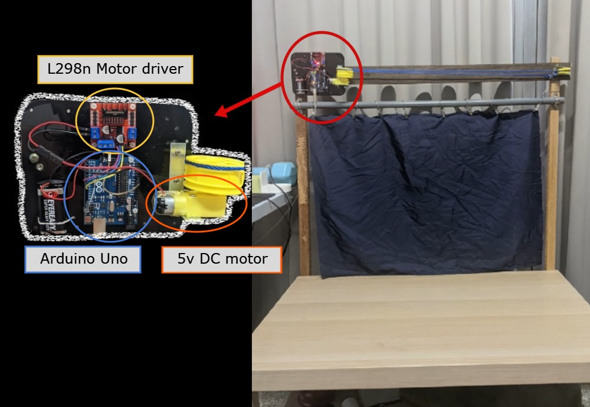

# Access guard

https://www.youtube.com/watch?v=s63793YxSP8

## Motivation
While I stay at home during the pandemic , there are a lot of inconvenience in my room. 

>

## Hardware

* Arduino Uno
* L298n Motor driver
* Tire gear rim 
* 5v DC motor 
* 9v battery 

## Software

### Prerequisites

### 1. Data Collection
The main goal of this stage is to gather as many images of faces as you are authorized to access. The more images you collect, the more accurate your model will be.

### 2. AlexNet Model Training in MATLAB
By using the data that is collect to trains a convolutional neural network (CNN) with AlexNet model, for a specific class classification task, and saves the trained network.  

### 3. Result

